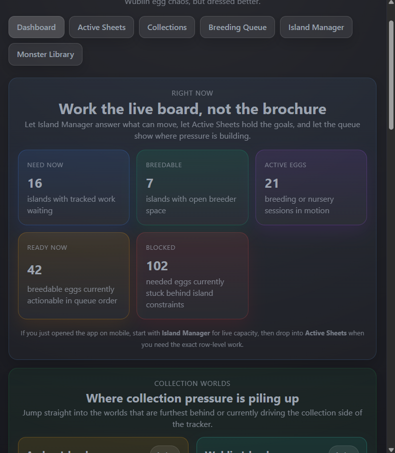
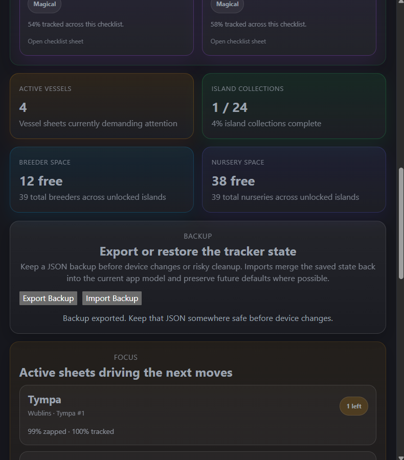
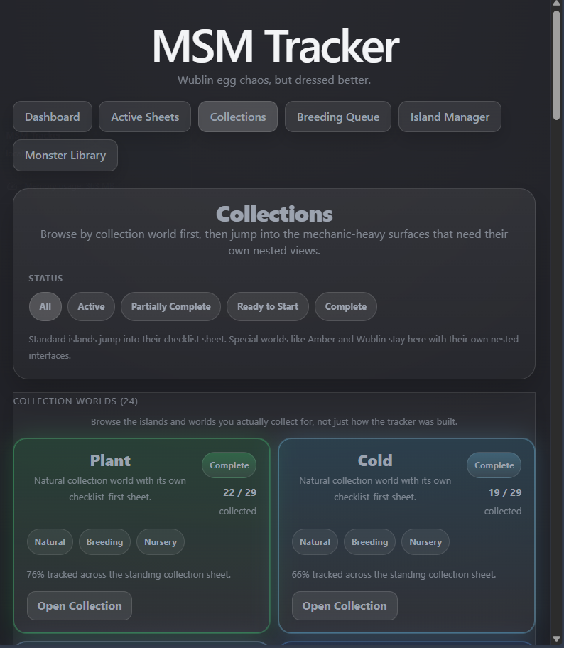
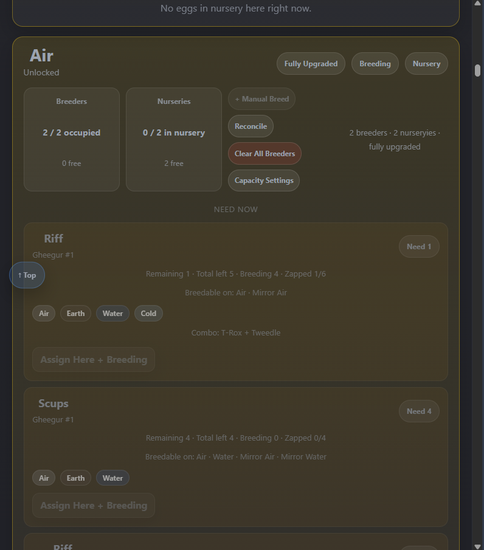
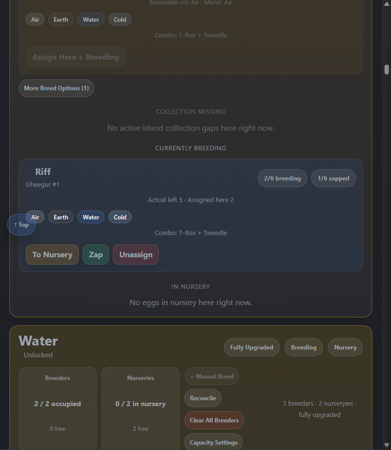
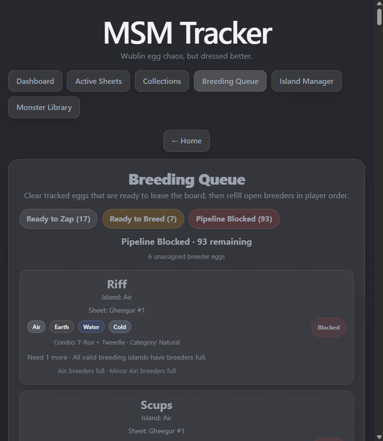
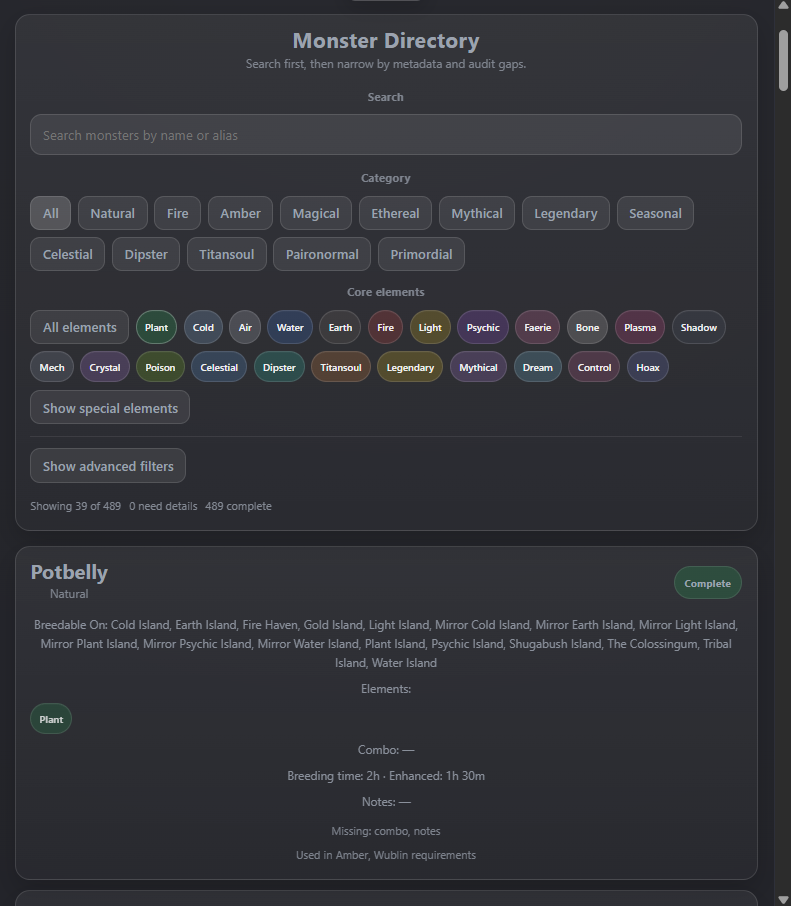

# MSM Tracker


Track My Singing Monsters breeding work with one app that keeps long-term goals, live breeder occupancy, and island-by-island execution tied together.

MSM Tracker is a local-first companion for players who want one place to manage collection progress, active breeding pressure, and live island state without bouncing between spreadsheets, notes, and memory.

## Status

- Current version: `0.4.0`
- Current release tag: `v0.4.0`
- Web app is working and actively used
- Android wrapper is set up through Capacitor
- Current breeding-data target is operationally complete for tracked requirement monsters
- Backup export/import is built into the app
- Build and test checks are passing

## What This App Does

MSM Tracker is built around a simple rule:

- sheets describe demand and progress
- `breedingSessions` describe live execution state
- queue and planner are derived views, not a second state system

That gives the app a practical workflow:

1. choose goals
2. activate the sheets that matter right now
3. see what is ready to zap or breed
4. manage island capacity and active breeders
5. keep the live game and the tracker in sync

## Current Features

### Goal Tracking

- shared sheet system for vessel sheets and island collection sheets
- Active Sheets view for currently relevant work only
- collection-world browser for browsing tracked goals without leaving the sheet model
- Wublin multi-instance support with separate tracked identity per instance

### Operational Workflow

- Breeding Queue split into:
  - `Ready to Zap`
  - `Ready to Breed`
- Island Manager with:
  - island capacity tracking
  - breeder and nursery occupancy
  - demand projection
  - manual breeding support
  - context-aware jump-to-island navigation
  - island-side reconciliation for fixing tracker drift against what is actually on the board
- row-linked `Breed on...` and `Zap Ready` actions from sheets

### Breeding Data / Reference

- Monster Directory for browsing monster metadata and breeding info
- imported combo and breeding-time data layered on top of the hand-authored baseline
- manual breeding by parent pair with:
  - exact-result inference when current data is strong enough
  - truthful `Mystery Egg` fallback when it is not

### Data Pipeline

- raw inbox ingestion for messy research dumps
- parsing, promotion, and audit commands for growing the runtime data safely
- explicit operational breeding-completeness audit

### Safety / Validation

- browser persistence is centralized through shared backup helpers instead of scattered inline save/load code
- export/import backup flow is available from the Dashboard
- a lightweight Node test layer now validates the persistence and reconciliation helpers

## Screenshots

### Dashboard

Dashboard now acts like a launchpad, not just a stats page. It links into live board work, collection worlds, backup flow, and focus sheets.





### Collections

Collections is now organized around collection worlds instead of old implementation buckets, so standard islands and special worlds read more like the game itself.



### Island Manager

Island Manager handles live breeder capacity, what needs attention next, and what is already breeding on the board.





### Breeding Queue

The queue separates what is actionable right now from what is blocked, so pressure is easier to read honestly.



### Monster Library

Monster Library gives you searchable monster metadata, filters, and audit-friendly breeding reference in one place.



## Main Screens

- `Dashboard`
  - summary-first command center
- `Active Sheets`
  - quick view of the work currently driving action
- `Collections`
  - species and collection browsing
- `Breeding Queue`
  - what to zap now and what to breed next
- `Island Manager`
  - island-by-island execution surface
- `Monster Library`
  - read-only monster and breeding reference
- `Tracker Sheet`
  - shared detailed sheet view

## Why It Exists

This project is for real play, not just data display.

The goal is to make the game easier to manage when you are juggling:

- multiple islands
- active breeders and nurseries
- Wublin zaps
- Amber vessels
- collection gaps
- temporary manual breeding sessions

The app is meant to feel like a practical companion, not a spreadsheet with prettier buttons.

## Android Path

The repo now has an Android wrapper path using Capacitor.

What is already done:

- Capacitor config exists
- native `android/` project exists
- web build sync into Android works
- emulator install path works
- debug APK packaging works

See:

- [docs/ANDROID.md](docs/ANDROID.md)

## Local Development

For the full command index, see:

- [COMMANDS.md](COMMANDS.md)

From the repo root:

```bash
npm install
npm run dev
```

The app entrypoint is:

```text
src/main.jsx -> src/App.jsx
```

Useful commands:

```bash
npm run build
npm run preview
npm run lint
npm test
```

## Data Workflow

Raw research goes into:

```text
data-entry/inbox.txt
```

Then process it with:

```bash
npm run parse:inbox
npm run promote:breeding-data
npm run audit:operational-data
```

Key generated outputs:

- `data-entry/parsedBreedingData.json`
- `data-entry/gameMechanicsReference.md`
- `src/data/breedingCombosImported.json`
- `data-entry/operationalBreedingCoverage.md`

## Release Workflow

This repo now has a lightweight intentional release flow:

```bash
npm run release:review
npm run release:prepare -- <version>
npm run build
npm run release:notes
npm run android:package-debug
npm run release:tag
```

The idea is:

- do not cut fake releases for every tiny pass
- do cut real releases when the changelog and audit state justify it
- keep the GitHub release asset and Android debug APK in sync with the tagged version

## Tech Stack

- React
- Vite
- Capacitor for Android packaging
- localStorage persistence
- Node test runner for lightweight validation
- plain JS data/model layer

## Current Priorities

- continue moving Collections toward a true collection-first catalog, including richer Rare/Epic coverage
- keep tightening mobile and desktop consistency across Collections, Active Sheets, Island Manager, and Monster Library
- keep improving reconciliation and correction flows so tracker drift is easy to repair
- eventually move from debug APK sharing to a proper signed Android release build

## Project Docs

- [COMMANDS.md](COMMANDS.md)
- [TODO.md](TODO.md)
- [docs/ARCHITECTURE.md](docs/ARCHITECTURE.md)
- [docs/ANDROID.md](docs/ANDROID.md)
- [CHANGELOG.md](CHANGELOG.md)
